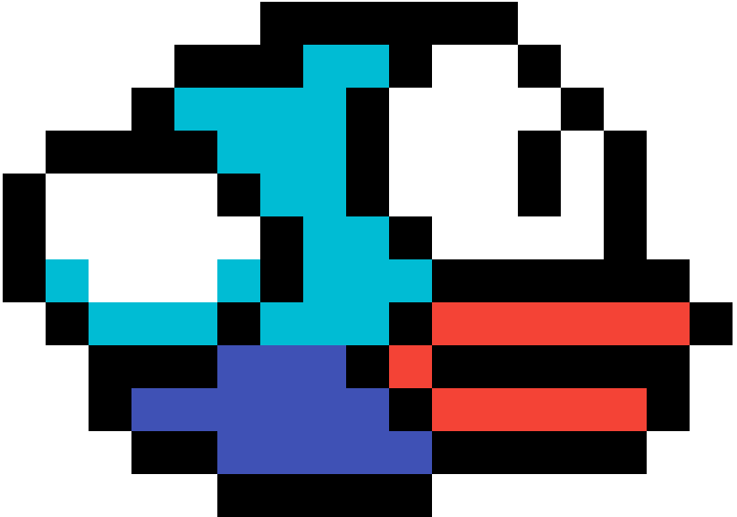

# Flappy 
### -Game Concept- 
Browser __Minigame__ developed in __Javascript__, it's very similar to 'FlappyBird', the unique rule is to don't touch the tubes.
You can challenge your friends and see who do the best score!
### -The Code-
>Html
>>Javascript
>>>CSS

You can see how I coded it [Here](https://youtu.be/ZYYeFZvZqWk)

Html and CSS is used just for the structure of the site, the main element is the Javascript Canvas, we can divide the __main.js__ into two big functions:
- setup( )
- update( )

setup() is the function that is called at the start of the game, here I initialize the __Player Class__, the __Canvas__ and the __KeyPress Listener__;

update() is the Graphics Engine of this minigame, it __draw__ the element on the canvas and check if player touched a tube.
### -Player-
Player is the class that draw our avatar (bird), it has four importan variable:
- x 
- y
- vy ( speed of y )
- g  ( gravity )

And three main methods:
- show ( this methods is used by update() for drawing our Player)
- fly ( every time that we press any key vy takes -2 )
- gravity (is always called and it sum vy to y)

### -Tube-
Tube is just an array of X and Y, new tubes are generated in update() with random y and x.

